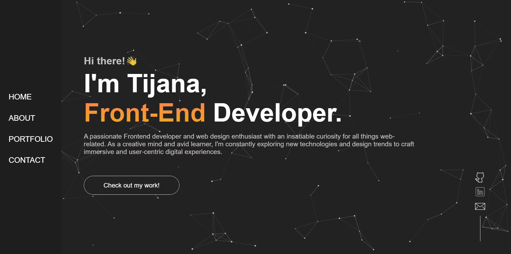
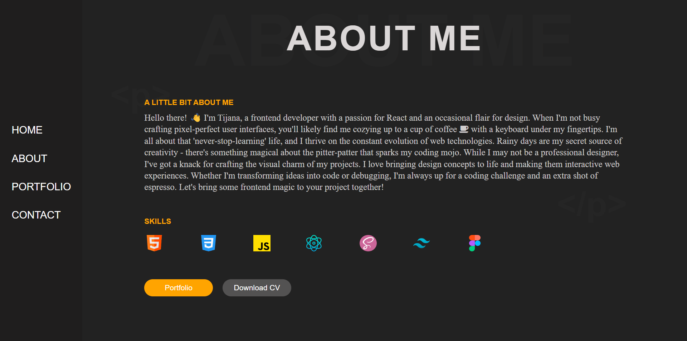
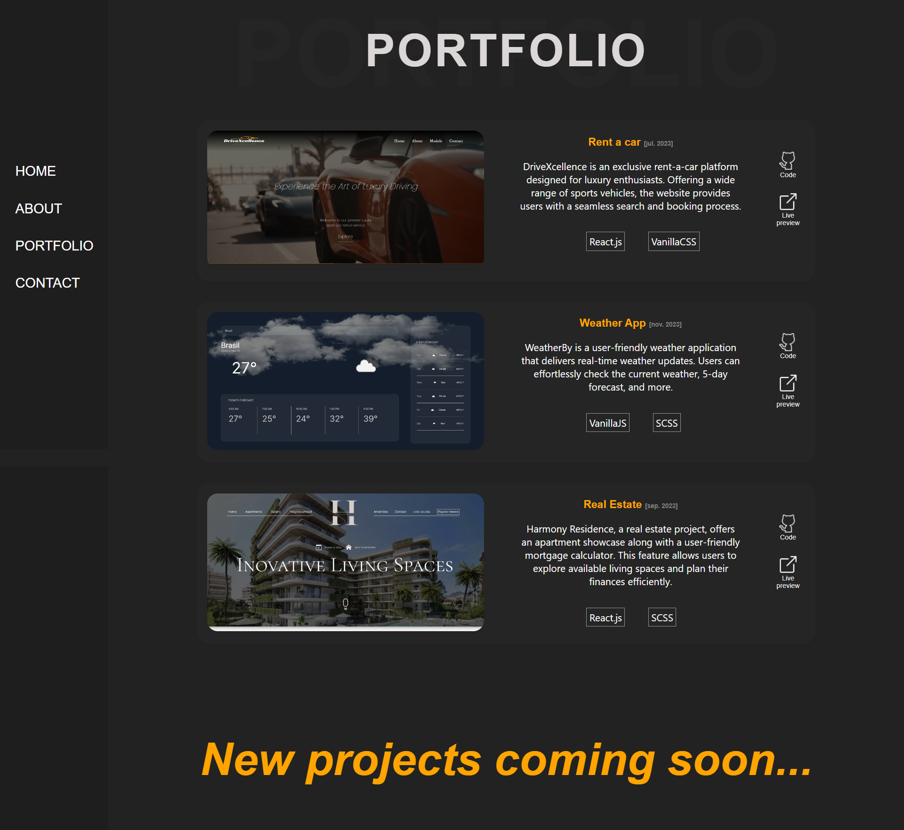
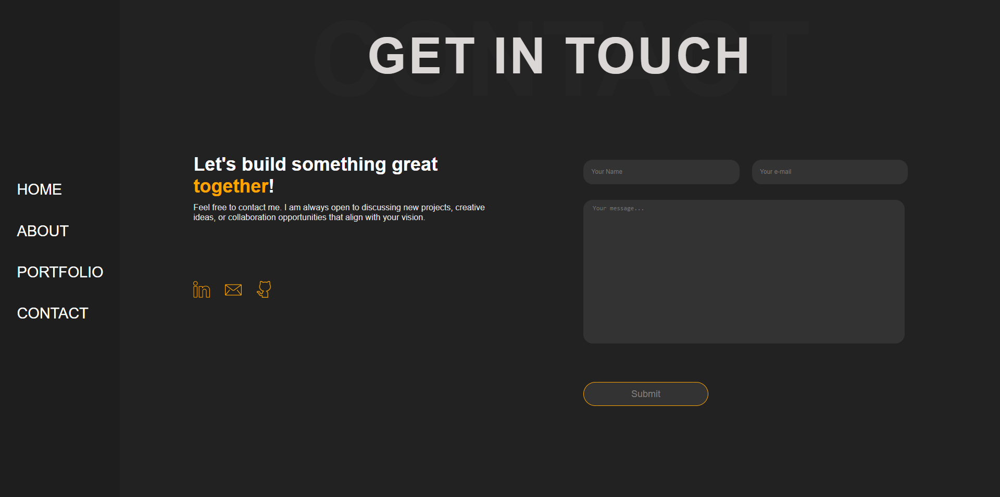

<h1>Personal Portfolio</h1>
Live Demo: <a href='https://tijanadj.vercel.app/'>Portfolio</a>
» React JS  
» SCSS

  <h2>Portfolio Screenshots</h2>

<h3 align='center'>Home Page </h3>

<h3 align='center'>About Me Page </h3>

<h3 align='center'>Portfolio Page </h3>

<h3 align='center'>Contact Page </h3>

